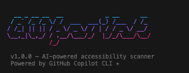

# 🛫 a11y-pilot

> **Your accessibility co-pilot for the terminal.**
> AI-powered CLI that scans frontend codebases for accessibility issues and auto-fixes them using GitHub Copilot CLI.

<p align="center">
  
</p>

---

## What is a11y-pilot?

**a11y-pilot** is a CLI tool that works like ESLint for accessibility. Run it in any frontend project directory to:

1. **Scan** your HTML, JSX, and TSX files for accessibility violations
2. **Report** issues with file, line number, severity, and WCAG references
3. **Auto-fix** issues by invoking GitHub Copilot CLI as the refactoring engine

It catches real problems that affect real users — missing alt text, non-semantic buttons, unlabeled form inputs, broken heading hierarchies, and more.

## Why?

**95%+ of websites fail basic accessibility checks** ([WebAIM Million Report](https://webaim.org/projects/million/)). Most developers don't skip accessibility on purpose — they just don't have the tools that make it easy. a11y-pilot brings a11y linting right into your terminal workflow, and uses Copilot CLI to fix issues intelligently.

---

## Installation

```bash
# Install globally
npm install -g a11y-pilot

# Or use directly with npx (no install needed)
npx a11y-pilot scan ./src
```

## Quick Start

```bash
# Scan your frontend project
a11y-pilot scan ./src

# Scan a specific file
a11y-pilot scan ./src/App.tsx

# Show Copilot CLI fix commands for each issue
a11y-pilot scan ./src --fix

# Auto-fix all issues using GitHub Copilot CLI
a11y-pilot fix ./src

# Or use the scan command with --auto-fix flag
a11y-pilot scan ./src --auto-fix
```

> **Note:** Auto-fix requires [GitHub Copilot CLI](https://github.com/github/copilot-cli) to be installed and authenticated.

---

## Commands

### `scan [path]`

Scan files for accessibility issues.

```bash
a11y-pilot scan                      # Scan current directory
a11y-pilot scan ./src/components     # Scan specific directory
a11y-pilot scan ./src/App.tsx        # Scan a single file
```

**Flags:**

| Flag | Description |
|------|-------------|
| `-r, --rules <rules>` | Comma-separated rule IDs to check (e.g., `img-alt,no-div-button`) |
| `-f, --format <format>` | Output format: `text` (default) or `json` |
| `--fix` | Show Copilot CLI commands for each issue |
| `--auto-fix` | Invoke Copilot CLI to auto-fix issues |
| `--dry-run` | Preview what auto-fix would do (no changes) |
| `--one-by-one` | Fix issues individually instead of batching |

### `fix [path]`

Convenience command — scans and auto-fixes in one step.

```bash
a11y-pilot fix ./src
a11y-pilot fix ./src --dry-run
```

### `rules`

List all available accessibility rules.

```bash
a11y-pilot rules
```

---

## Rules

a11y-pilot ships with 8 high-impact accessibility rules:

| Rule | Severity | WCAG | What it catches |
|------|----------|------|----------------|
| `img-alt` | error | 1.1.1 | `` without `alt` attribute |
| `button-content` | error | 4.1.2 | Empty `<button>` with no text/aria-label |
| `no-div-button` | error | 4.1.2, 2.1.1 | `<div>`/`<span>` with `onClick` but no `role`/`tabIndex` |
| `form-label` | error | 1.3.1, 4.1.2 | `<input>` without associated label or `aria-label` |
| `heading-order` | warning | 1.3.1 | Skipped heading levels (h1 → h3) |
| `anchor-content` | error | 2.4.4, 4.1.2 | `<a>` with no text content or `aria-label` |
| `no-autofocus` | warning | 3.2.1 | Usage of `autoFocus` attribute |
| `semantic-nav` | warning | 1.3.1, 2.4.1 | Navigation links not wrapped in `<nav>` |

---

## Copilot CLI Integration

a11y-pilot uses GitHub Copilot CLI as its AI-powered fix engine. When you run `--auto-fix` or `a11y-pilot fix`:

1. **Detection** — a11y-pilot scans your code and identifies issues
2. **Prompt Engineering** — For each issue, it builds a precise, context-rich prompt
3. **Copilot Invocation** — It spawns `copilot` CLI with the fix prompt
4. **Intelligent Fixing** — Copilot CLI reads your file, understands the context, and makes the fix
5. **Progress Reporting** — You see real-time status of each fix

### How it works under the hood

```
┌─────────────────┐     ┌──────────────────┐     ┌─────────────────┐
│   a11y-pilot    │────▶│  Issue detected   │────▶│  Build prompt   │
│   scanner       │     │  (rule engine)    │     │  (context-rich) │
└─────────────────┘     └──────────────────┘     └────────┬────────┘
                                                          │
                                                          ▼
┌─────────────────┐     ┌──────────────────┐     ┌─────────────────┐
│   File fixed!   │◀────│  Copilot applies  │◀────│  copilot CLI    │
│   ✔ Report      │     │  the fix          │     │  invoked        │
└─────────────────┘     └──────────────────┘     └─────────────────┘
```

### Prerequisites

- **Node.js 18+**
- [GitHub Copilot CLI](https://github.com/github/copilot-cli) installed and authenticated (required only for auto-fix)

```bash
# Install a11y-pilot
npm install -g a11y-pilot

# Install & authenticate Copilot CLI (for auto-fix)
# See: https://github.com/github/copilot-cli
copilot auth login
```

---

## JSON Output (CI-friendly)

```bash
a11y-pilot scan ./src --format json
```

Outputs structured JSON:

```json
{
  "version": "1.0.0",
  "timestamp": "2026-02-14T10:00:00.000Z",
  "summary": {
    "filesScanned": 23,
    "filesWithIssues": 5,
    "totalErrors": 12,
    "totalWarnings": 3,
    "totalIssues": 15
  },
  "files": {
    "src/Hero.tsx": [
      {
        "ruleId": "img-alt",
        "severity": "error",
        "message": " is missing the `alt` attribute",
        "line": 12,
        "fix": "Add alt=\"descriptive text\" or alt=\"\" if decorative",
        "copilotCommand": "copilot \"In file src/Hero.tsx at line 12...\""
      }
    ]
  }
}
```

---

## Supported File Types

| Extension | Parser |
|-----------|--------|
| `.jsx` | Babel (JSX) |
| `.tsx` | Babel (TSX + TypeScript) |
| `.html`, `.htm` | htmlparser2 |
| `.vue` | htmlparser2 (template) |
| `.svelte` | htmlparser2 (template) |
| `.astro` | htmlparser2 (template) |

---

## Project Structure

```
a11y-pilot/
├── bin/
│   └── a11y-pilot.js            # CLI entry point
├── src/
│   ├── cli.js                   # Commander setup & orchestration
│   ├── scanner.js               # File discovery & walking
│   ├── parsers/
│   │   ├── jsx-parser.js        # JSX/TSX AST parsing
│   │   └── html-parser.js       # HTML parsing
│   ├── rules/
│   │   ├── index.js             # Rule registry
│   │   ├── img-alt.js           # Missing alt attributes
│   │   ├── button-content.js    # Empty buttons
│   │   ├── no-div-button.js     # Non-semantic click handlers
│   │   ├── form-label.js        # Unlabeled form inputs
│   │   ├── heading-order.js     # Heading hierarchy
│   │   ├── anchor-content.js    # Empty links
│   │   ├── no-autofocus.js      # autoFocus anti-pattern
│   │   └── semantic-nav.js      # Missing <nav> landmarks
│   ├── reporter.js              # Terminal output (colors/formatting)
│   └── copilot-bridge.js        # Copilot CLI invocation engine
├── test/
│   └── fixtures/                # Sample files with a11y issues
├── docs/
│   └── PLAN.md                  # Project plan
├── package.json
├── LICENSE
└── README.md
```

---

## Built With GitHub Copilot CLI

This entire project was built using GitHub Copilot CLI as a core development tool. Copilot CLI was used for:

- Scaffolding the project structure
- Writing parser logic for JSX/TSX AST traversal
- Implementing accessibility rules with WCAG references
- Debugging edge cases in HTML parsing
- Generating test fixtures
- Writing documentation

See the [submission article](#https://dev.to/safvantsy/what-if-your-a11y-linter-could-actually-fix-the-bugs-it-found-4coe) for terminal screenshots and a full walkthrough.

---

## License

MIT — see [LICENSE](LICENSE) for details.

---

## Contributing

Contributions welcome! Ideas for new rules, parser improvements, or better Copilot CLI integration are all appreciated.

```bash
# Clone the repo
git https://github.com/Safvan-tsy/a11y-pilot.git
cd a11y-pilot
npm install

# Run tests
npm test

# Scan the test fixtures during development
a11y-pilot scan test/fixtures/
```

---

<p align="center">
  <strong>a11y-pilot</strong> — Making the web accessible, one terminal command at a time. 🛫
</p>
